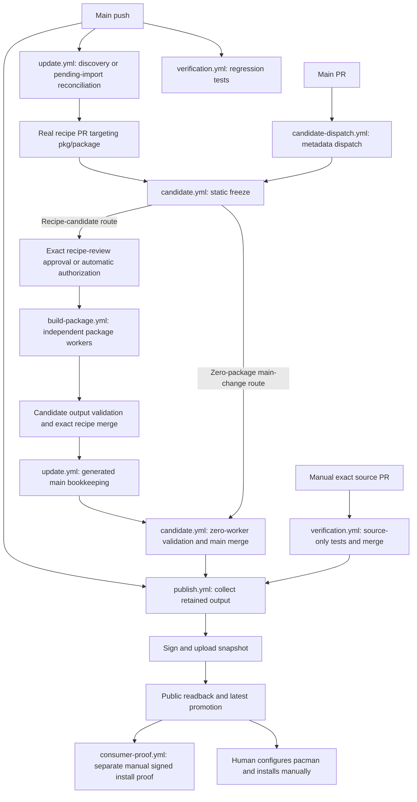
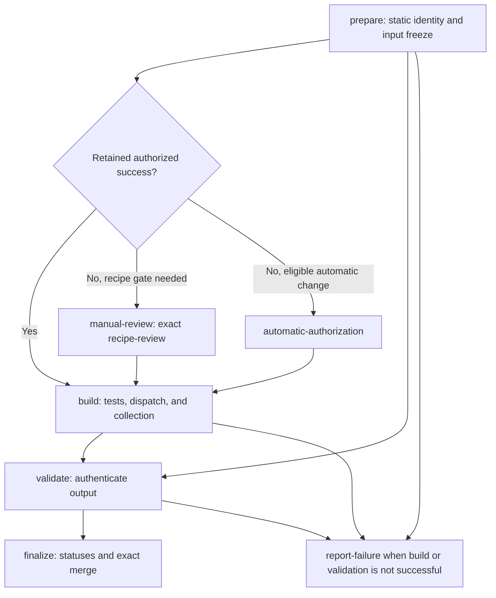
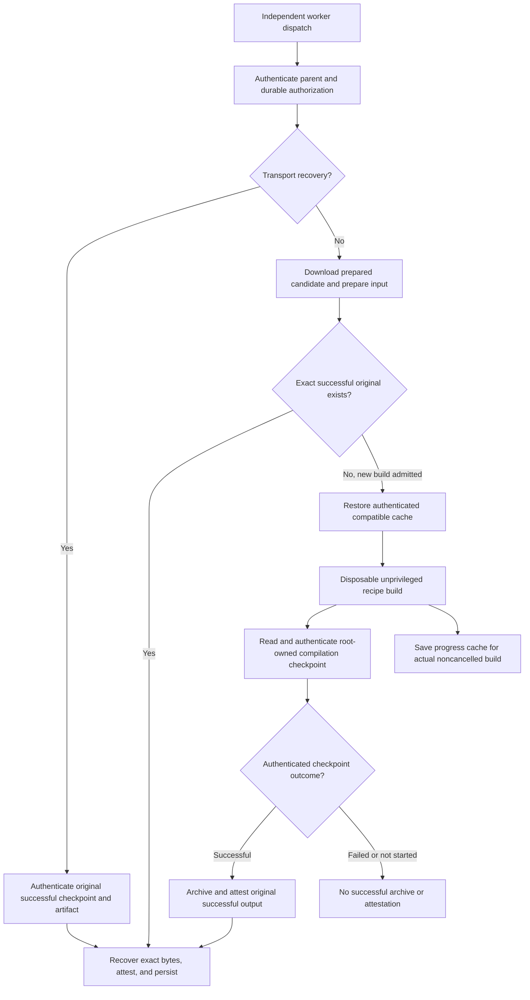
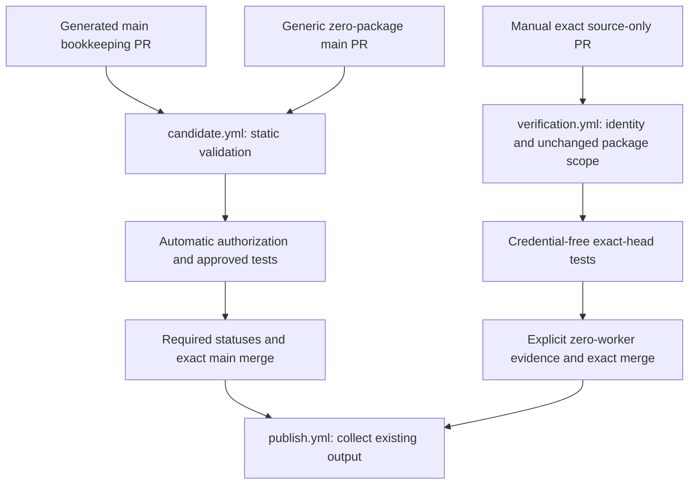
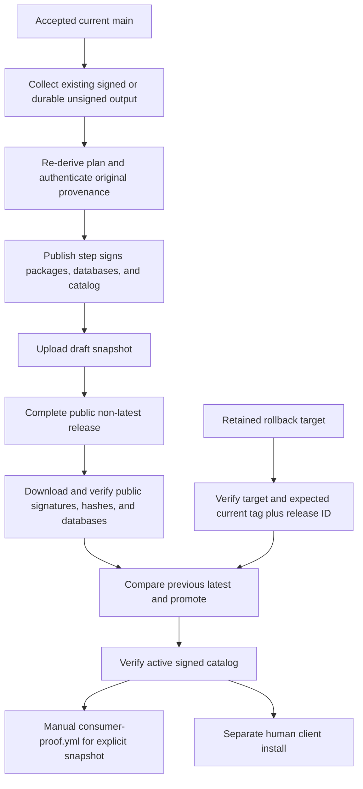

# System flow

`arch-packages` turns source changes into reviewed recipes, authenticated builds, and signed Arch snapshots. This repository owns controller code, workflows, tests, and policy. The `vith/oh-my-pi` fork supplies input, and n3t supplies signed dependencies. This pipeline administers neither repository and never installs packages on client machines.

## Identity and ownership

A workflow contains jobs and sequential steps. Actions implement steps. A run can have multiple attempts, and evidence binds both identities. Workers are independent `build-package.yml` runs, not reusable workflows.

None of the seven workflows declares `workflow_call` or uses `jobs.<job>.uses`.

| Identity | Contract |
| --- | --- |
| C | Immutable trusted controller revision and harness identity. |
| B | Exact proposal base or predecessor. |
| H | Full reviewed PR head SHA, never a moving branch. |
| Input digest | Authenticated recipe, source locks, policy, and harness compilation identity. |
| Original producer | Authenticated successful compilation run and attempt. Collection, recovery, acceptance, and publication preserve its identity and bytes. |

Recipe revisions differ from trusted main control. Source review also binds exact main base. Compatible controller changes can reuse exact output. Old-head approval never authorizes a changed head, even when executable code remains unchanged.

Candidate `prepare` statically freezes inputs without executing recipes. Recipe `PKGBUILD` `prepare()` is executable code that `makepkg` may later run.

| Data owner/location | Contents |
| --- | --- |
| Main `packages.json` | Enrollment policy and pending-import registry. Registration grants no execution authority. |
| Main `recipes/`, `.gitmodules` | Accepted gitlinks and submodule mapping. Recipe commits remain outside the controller tree. |
| Main `inputs/`, `upstream/`, `acceptance/` | Frozen source locks, upstream tracking, and accepted-recipe-to-original-build mappings. |
| Protected `pkg/<name>` | Maintained recipe history and real recipe PR targets. |
| `aur/<name>` | Imported AUR history preserving upstream ancestry. |
| `controller-state` | Append-only decisions and original-output descriptors. |
| Workflow artifacts | Expiring transport and diagnostics, not durable authority. |
| Never-public draft `build-<input_digest>` releases | Durable unsigned bytes and proof. |
| Public `snapshot-...` releases | Immutable signed packages, databases, catalog, and provenance. `latest` selects a verified release. |

State namespaces are `proposal`, `candidate`, `candidate-provenance`, `built`, `approved`, `acceptance`, and `built-by-input`. Identity envelopes digest exact values and cannot change. Concurrent saves preserve the tree with exact leases and at most 32 retries after competing ref updates.

Durable releases contain `unsigned.tar` and `attestation.jsonl`. Readback must succeed before saving immutable `built-by-input`. Prepared artifacts never replace original bytes or receipts.

Attestation supplies independent OIDC-backed provenance for candidate or worker archives/context. Bot status receipts are not Sigstore attestations. Publication signing covers packages, databases, and catalog. Cache only retains authorized compiler/dependency progress, never successful output or publication authority.

## Lifecycle

Registration only freezes sources without running recipes. Pending imports stay outside routine discovery/publication until activation. Approved recipe candidates can build before bookkeeping activates them.

Bookkeeping needs completed successful authorization evidence. It records gitlink, locks, upstream, and original acceptance provenance, and can activate pending imports.

Generated bookkeeping and generic zero-package main changes select zero workers. Bookkeeping needs no second recipe approval or compilation. Unchanged source receipts without open proposals are no-ops and leave retained branches untouched. Proposal writes, refreshes, and dispatches need authenticated watcher ownership.

## Shared permissions, outputs, and scheduling

Every checkout uses `persist-credentials: false`. Only workers use compiler cache. Only publication signing receives the private key. Unlisted jobs receive no approval environment, compiler cache, or signing secret.

Permission abbreviations below expand to GitHub scopes. `R` means read and `W` means write.

| Workflow/job | Permissions and environment | Outputs/retention |
| --- | --- | --- |
| `update`: `discover` | contents R | `source-receipts`: `source-data.tar`, 2 days |
| `update`: `reconcile`, `write-proposals` | contents, PR, Actions, statuses W | Validated receipts and proposal/bookkeeping writes |
| `candidate-dispatch`: `dispatch` | contents, PR R, Actions W | Metadata dispatch only |
| `candidate`: default | contents R | `prepared-candidate-<attempt>`, `native-candidate-<attempt>`: 2 days |
| `candidate`: `prepare` | contents/statuses W, Actions/PR R, OIDC/attestations W | Static identity and candidate attestation |
| `candidate`: authorization jobs, `validate` | contents/statuses W, Actions/PR R. `manual-review`: `recipe-review` | Durable authorization and validation |
| `candidate`: `build` | contents/statuses/Actions W, PR R | Worker dispatch and collection |
| `candidate`: `report-failure` | contents/PR R, statuses W | Failure status |
| `candidate`: `finalize` | contents/PR/statuses/Actions W | Protected merge and follow-up dispatch |
| `build-package`: `package` | contents/statuses W, Actions R, OIDC/attestations W | `package-<package>-<run>-<attempt>`: 90 days, plus durable draft storage |
| `verification`: default, `regression-tests` | contents R, statuses W | Main verification statuses |
| `verification`: `source-identity` | contents/PR/Actions R | Exact identity |
| `verification`: `source-validation` | contents/PR/Actions R, statuses W | `source-review-evidence-<attempt>`: 90 days |
| `verification`: `source-merge` | contents/PR/Actions W, statuses R | Exact merge and publication dispatch |
| `publish`: `collect` | contents/Actions R | `publication-plan-<attempt>`, `unsigned-publication-<run>-<attempt>`: 7 days |
| `publish`: `publish` | contents W, Actions R, `publish` environment | Signed release and publication receipt |
| `publish`: `rollback` | `publish` environment, no private signing-key environment | Rollback receipt |
| `consumer-proof`: `consumers` | contents R | `consumer-proof-<run>-<attempt>`: 14 days, including failures |

| Workflow | Concurrency group | Explicit timeout |
| --- | --- | --- |
| `update.yml` | `source-update` | |
| `candidate-dispatch.yml` | None | |
| `candidate.yml` | `candidate-<PR>` | `prepare` 30 minutes, `build` 190 minutes |
| `build-package.yml` | `approved-package-<input_digest>` | `package` 150 minutes |
| `verification.yml` | `verification-<event>-<PR or ref>` | `regression-tests` 30 minutes |
| `publish.yml` | `arch-packages-publication`, shared with rollback | `collect` 190 minutes |
| `consumer-proof.yml` | None | `consumers` 60 minutes |

All five groups use `cancel-in-progress: false`. This blocks automatic replacement cancellation, not manual cancellation or timeouts. This cancellation policy does not guarantee every queued run will run.

## Source update proposals

[`update.yml`](../.github/workflows/update.yml) runs on main push, schedule `17 */6 * * *` UTC, and manual dispatch.

| Manual input | Type/default | Effect |
| --- | --- | --- |
| `bootstrap` | Optional boolean, `false` | Initial read-only static source freeze, no proposals or execution |
| `migrate_pr` | Optional string, empty | Convert/backfill one legacy main recipe-update PR |
| `reconcile_pr` | Optional string, empty | Reconcile one native recipe/bookkeeping PR |

Modes are mutually exclusive and main-only. PR numbers must be positive decimals. Trusted checkout uses event SHA, and tools reject controllers no longer current main.

| Mode | Jobs and dependencies |
| --- | --- |
| Push | `reconcile` only |
| Schedule/default manual | `reconcile` → `discover` → `write-proposals` |
| Bootstrap | Skip reconciliation/writing, run read-only discovery |
| Targeted reconciliation | Fetch selected PR only, no unrelated redispatch, discovery, or proposals |
| Migration | Reconcile legacy conversion/backfill, skip discovery and normal writing |

Discovery's `always()` admits reconciliation success or bootstrap skip, excluding push/recovery. Writing needs discovery and excludes bootstrap/recovery.

Full reconciliation can redispatch all open enrolled recipe PRs and current bookkeeping, recording retired package-root targets as skipped. Migration authenticates exact one-root enrolled change, bot receipt, source identity, predecessor, and current policy. It creates/reuses a replacement, dispatches a fresh candidate, and supports accepted legacy backfill. Legacy approval never transfers, and the old PR remains open unless separately closed.

The writer checks current main, predecessor, and watcher ownership. It preserves ancestry in `recipe-updates/<name>/<watcher>` PRs targeting `pkg/<name>` and explicitly dispatches candidates. Receipt extraction is bounded and validated before writes.

## Start candidate validation

[`candidate-dispatch.yml`](../.github/workflows/candidate-dispatch.yml) handles main-target `pull_request_target`: `opened`, `synchronize`, `reopened`, and `ready_for_review`.

Independent `dispatch` checks non-draft, open, main-target PR metadata, then dispatches candidates on main with numeric PR and current full head. It neither checks out nor executes PR files. It has no manual inputs or actions.

Package-root branches contain no workflows. Writers, reconciliation, or humans dispatch them explicitly. This dispatcher does not select source-only verification.

## Exact candidate validation

[`candidate.yml`](../.github/workflows/candidate.yml) uses manual/API `workflow_dispatch` with trusted main control and harness code.

| Manual input | Type/default | Effect |
| --- | --- | --- |
| `pr_number` | Required string, no default | Select exact PR |
| `expected_head` | Required string, no default | Reject head mismatch |

Run title: `Candidate PR <pr_number> head <expected_head>`.

| Job | Dependency/guard and contract |
| --- | --- |
| `prepare` | Main-only static freeze of sources, recipes, policy, metadata, B/H, and compilation identity. Reject invalid/unsupported inputs. |
| `manual-review` | Needs prepare and selected environment route. Title: `Review PR <N> head <H> base <B>`. |
| `automatic-authorization` | Needs prepare and selected automatic route. Title: `Authorize PR <N> head <H> base <B>`. |
| `build` | Needs prepare and both authorization jobs. `always()` admits authorized reuse or either successful route despite inactive-route skip. Runs approved tests, dispatches workers, collects. |
| `validate` | Needs successful prepare/build. Authenticates native receipts and bytes. |
| `report-failure` | Depends on prepare/build/validate. Successful prepare plus unsuccessful build/validation reports candidate-build failure, without compiler retry. |
| `finalize` | Depends on prepare/validate and both authorization routes. Needs validation success plus authorization or authorized reuse. |

Preparation independently attests `candidate.json` before fresh authorization unless original provenance exists. Outputs include `base`, `head`, `mechanical`, `review_environment`, and `authorized_reuse`.

Both authorization jobs revalidate exact identity and persist authorization. New/nontrivial recipe code needs exact review before execution. Enrolled literal version, `pkgrel`, and checksum edits, or unchanged executable code, can qualify automatically after independent checks.

Exact authenticated authorized success retains its original record with current-controller context, sets `authorized_reuse=true`, and skips fresh approval and compilation. New authorization uses neither `code-review` nor a separate bookkeeping gate. Native recipe tests check identity/authorization, not source tests. Coordinators never compile.

Finalize checks `verify`, `candidate-build`, and `recipe-policy`, then merges exact head through normal protection. Recipe merges dispatch update bookkeeping. Main merges dispatch publication with accepted SHA.

## Build one package

[`build-package.yml`](../.github/workflows/build-package.yml) starts independent manual/API workers. Its single independent `package` job is main-only.

Title: `Build <package> / <publication_run>.<publication_attempt> / <input_digest>`.

| Manual input | Type/default | Effect |
| --- | --- | --- |
| `package` | Required string, no default | Authorized package |
| `publication_run` | Required string, no default | Original approval candidate run, not a compiling publisher |
| `publication_attempt` | Required string, no default | Original approval candidate attempt |
| `input_digest` | Required string, no default | Exact authorized compilation identity |
| `recovery_mode` | Boolean, `false` | Transport-only recovery, never compilation |
| `original_run` | String, empty | Successful original producer run |
| `original_attempt` | String, empty | Successful original producer attempt |
| `original_artifact` | String, empty | Immutable producer artifact JSON: ID, ZIP digest, size, transport recovery only |
| `original_candidate_key` | String, empty | Historical candidate receipt key for legacy recovery |
| `archive_format` | Choice, `native-v2` | Protocol selection, also `legacy-native-v1` |

Before execution/cache access, workers authenticate parent workflow path, head, run, attempt, and durable authorization. New compilation also needs matching current main/control. Normal preparation downloads parent prepared artifacts with a token, then reuses original output or exports the owned recipe. Historical harnesses can need full exports, and workers authenticate the complete roster and immutable pins.

`build.sh` runs an unprivileged builder in a disposable pinned Arch x86_64 container. Root-owned `compilation.json` distinguishes successful, failed, and not-started compilation. Checkpoint steps use `continue-on-error`, and only authenticated matching state produces a success marker. Overall run color is not compilation evidence.

Successful `unsigned.tar` and `attestation-context.json` receive OIDC attestation. Package artifacts contain candidate, checkpoint, context, and bundle. Recovery authenticates original successful checkpoint and artifact ID/digest/size, then recovers, attests, and persists exact bytes without compilation/cache. Archive format never allows invented or substituted bytes.

| Cache field | Contract |
| --- | --- |
| Path | `~/.local/state/arch-packages/cache/<package>` |
| Prefix | `trusted-build-v1-linux-x86_64-<package>-<image-and-harness-hash>-` |
| Hash/key | First 24 SHA256 characters of image/harness identity, plus input digest and current run/attempt |
| Restore | Exact input prefix, then compatible package/image/harness prefix |
| Contents | Cargo/rustup/target, Bun, Go build/module, pip directories |

Only authorized normal builds without exact reuse restore/save cache. Actual noncancelled builds save successful/failed progress except exact hits. Cache errors are nonfatal, and workers repair runner ownership.

## Trusted recipe and publication verification

[`verification.yml`](../.github/workflows/verification.yml) runs on main push and manual dispatch, without compilation.

| Manual input | Type/default | Effect |
| --- | --- | --- |
| `pr_number` | Required string, no default | Exact source PR |
| `expected_head` | Required string, no default | Exact H |
| `expected_base` | Required string, no default | Exact B, equal to current main |
| `bootstrap` | Optional boolean, `false` | Initial controller from exact lightweight commit tag `source-review-<H>` |

Titles: `Trusted main verification <SHA>` or `Source review PR <N> head <H> base <B>`.

Push `regression-tests` independently marks `verify` pending, runs full tests, and reports success/failure/error. Manual jobs follow `source-identity` → `source-validation` → `source-merge`.

Identity binds an open same-repository main PR before checkout, checking base/head, run/ref/path/title, and allowed scope. Ordinary control comes from immutable base/main. Source bootstrap differs from update's read-only bootstrap.

`packages.json`, `.gitmodules`, `recipes`, `inputs`, `upstream`, and `acceptance` must remain unchanged. Identity also checks copied recipe bodies and rejects external forks. Credential-free exact-head tests write all three statuses needed for merge, including zero-worker `candidate-build`. Merge verifies an actual successful validation job/statuses before protected exact-head merge and explicit publication dispatch because Actions-token merges do not trigger push workflows.

Bookkeeping uses candidate validation, not source review. Reconciliation revalidates/reconstructs stale bookkeeping on latest main. A validated replacement may close the obsolete PR. Changes cover gitlink, lock, upstream, acceptance, and optional pending-import activation.

## Signed package snapshots

[`publish.yml`](../.github/workflows/publish.yml) runs on main push and manual dispatch.

| Manual input | Type/default | Effect |
| --- | --- | --- |
| `accepted_sha` | Optional string, event SHA when omitted | Exact accepted main commit |
| `operation` | Choice, `publish` | Publish or rollback |
| `target_tag` | Optional string, no declared default | Retained rollback snapshot |
| `expected_tag` | Optional string, no declared default | Expected current latest tag |
| `expected_release_id` | Optional string, no declared default | Expected current latest release ID |

Jobs follow `collect` → `publish`, or independent mutually exclusive `rollback`. Collection/rollback are main-only. Collection/publication rebind accepted SHA to current trusted main and reject stale targets. Publication never compiles, dispatches workers, or rebuilds missing output.

Collection plans against the previous signed catalog, choosing signed reuse or authenticated accepted durable unsigned builds. Publish revalidates main before checkout, re-derives the plan after unsigned download, and verifies original provenance.

Tools install before the secret step. Only signing receives `ARCH_SIGNING_KEY`, `ARCH_SIGNING_PASSPHRASE`, and `ARCH_SIGNING_FINGERPRINT`. Publication builds databases from package files and signs new packages, databases, and catalog. Unchanged packages retain bytes, signatures, and producer proof.

Snapshot tag: `snapshot-<accepted_sha>-<run_id>-<attempt>`.

Publish uploads a draft, completes a public non-latest release, verifies public signatures/hashes/databases/catalog, compares previous latest, promotes, and verifies the active catalog. Rollback verifies retained public target, signed catalog, bytes, and both expected current tag and release ID. It promotes exact retained output without deletion, building, or re-signing.

`publication-receipt-<run>-<attempt>` always uploads `publication-result.json`. Missing publication receipt evidence is an error. Rollback always uploads its receipt, with missing evidence producing a warning. Cross-rename rollback needs the matching client database section.

## Signed snapshot consumer proof

[`consumer-proof.yml`](../.github/workflows/consumer-proof.yml) is manual only. Publication never starts it.

| Manual input | Type/default | Effect |
| --- | --- | --- |
| `snapshot_tag` | Required string, no default | Explicit retained public snapshot |

Independent `consumers` checks out dispatch ref without a main-only guard. `consumer.py` verifies the snapshot and derives enrollment from its accepted commit, writing `expected.json` and `enrollment.json`. `smoke.sh` installs every enrolled output into a fresh Arch root using signed databases/packages and retained public assets. It runs consumer proofs, not client installation. Missing evidence warns.

## Action entrypoints

All six entrypoints use full commit SHA pins. Restore/save share one repository and commit, giving five repositories.

| Entrypoint | Role | Workflow users |
| --- | --- | --- |
| `actions/checkout` | Checkout | update, candidate, build-package, verification, publish, consumer-proof |
| `actions/upload-artifact` | Expiring transport/evidence | update, candidate, build-package, verification, publish, consumer-proof |
| `actions/download-artifact` | Handoffs, including authorized cross-run downloads | update, candidate, build-package, publish |
| `actions/attest` | Candidate/worker OIDC provenance | candidate, build-package |
| `actions/cache/restore` | Authorized compatible cache | build-package |
| `actions/cache/save` | Noncancelled successful/failed progress | build-package |

Shell, Python, `gh`, and Docker commands execute in run steps, not reusable actions. Supporting code and regression evidence live in [tools](../tools/) and [tests](../tests/).

## Containers, policy, and proof limits

Trusted host tools hold API credentials/OIDC outside recipe containers. Static inspection and authorization precede execution. API availability and recovery grant no execution authority.

| Boundary | Contract |
| --- | --- |
| Worker | UID 1000, dropped privileges, explicit PATH/cache, no inherited tokens. `docker cp` transfers inputs, harness, public keys, outputs, checkpoints. |
| Worker mounts | Only authenticated non-symlink job-owned per-package cache may bind `/ci-cache`. No host root/home/checkout/credentials or Docker socket. |
| Publication staging | `/packages` read-only, `/out` writable. Drop all capabilities, no-new-privileges, sanitized environment. No private-key home, tokens, or Docker socket. |
| Consumer setup | Copies without host binds. Fresh tmpfs/devpts/proc chroot needs `SYS_ADMIN`, `MKNOD`, `apparmor=unconfined`, unlike package builds. |
| Consumer execution | `setpriv` drops capabilities, `env -i` clears environment. Public proofs also use `unshare --net`. |
| Source/regression tests | Pinned Arch containers, source tests credential-free. Host handles metadata/statuses/merge. Regression includes native `vercmp`. Official verification-tool installation is not recipe execution. |

Dependencies use official Arch first, then signed `vith-gh`, then signed n3t `vith-arch`. Custom repositories need trusted package/database signatures. Workers freeze GitHub latest-release redirects to fixed dependency snapshots before installation. Manual consumers retain selected snapshots.

[OpenTofu](../opentofu/) declares a `recipe-review` reviewer and main-only `publish` without reviewers. Historical `code-review` has no new reviewers and remains for producer proof. Names and YAML do not establish deployed approval settings.

| Evidence | Scope and limits |
| --- | --- |
| Workers | Native `.SRCINFO` before/after `makepkg`, output identity/version/architecture/hashes, source-lock receipts. OMP checks version/help, addon fork stamp, PipeWire linkage. Recipes may define checks. |
| Coordinator/publication | Receipt authentication or public signature/hash/database/catalog readback, not signed installation or runtime proof. |
| Manual consumer | Full `smoke.sh`, ApexShot, public checks. ApexShot covers CLI version/help, native messaging, libraries, desktop assets, extension files. |

Consumer success does not prove live GNOME/Wayland capture/recording. Extension enablement, logout/login, and UI use remain manual.

Public [keys](../keys/): `arch-packages.asc`, `fingerprint`, `n3t.asc`. Full signing fingerprint: `9C293ABB1F701DA04BA2C0D5711FC9BDDC5AF617`. Private administrative keys and OpenTofu passphrase remain local state, not recipe inputs. See [Administration](../README.md#administration).

## Failure and recovery

Authenticated failed builds can retry with trusted compatible cache. Successful compilation followed by transport/storage failure, including approved OMP output, needs original-byte recovery, never recompilation. Missing successful bytes, uncertain outcomes, stale identity, or invalid provenance/signatures fail closed. HTTP 403 means failure, not authorization or assumed quota exhaustion.

Recovery checks durable descriptors, then bounded historical worker runs/attempts using authenticated checkpoints, not run color. Failed/not-started attempts can allow older-success searches. Uncertain outcomes or unrecoverable successful artifacts refuse recompilation.

Retained builds authenticate ordered harness/controller manifests from immutable source declaration bytes and modes. Recovery parses literal declarations without executing historical Python. Later additions do not invalidate original proof. Missing declared files or unsafe paths fail.

Historical single-root export fallback uses the same declared harness identity.

Archive tools install before approval/recovery preparation. Persistence, recovery, and bookkeeping need `bsdtar`. Actions ZIP and release downloads negotiate different media types. Storage redirects receive no API authorization tokens.

Collection polls every 30 seconds for 10,800 seconds within its 190-minute limit. Coordinator failure/movement does not cancel children. Inspect independent worker evidence separately.

### Historical-scan caveat

`recipe_candidates._completed_candidate` runs before new static classification/approval and scans retained recipe base/head keys without first excluding unapproved candidates. `build_store.lookup` can reach `package_runs.recover`, querying historical runs/jobs/artifacts merely to establish no completed build. This avoidable API work remains, but authorizes neither execution nor reuse. Recovered originals still need `verify_authorization` and provenance checks, with no implied API counts, reset times, or migration progress.

## Operator checklist

1. Check the exact PR/head title.
2. Check prepare evidence for B, C, and input digest.
3. Review actual recipe files before approval of new/nontrivial code.
4. Open linked workers for compiler output and authenticated checkpoints, not just run color.
5. Use `reconcile_pr` for targeted reconciliation. Bootstrap and migration have different contracts.
6. Recover successful originals rather than rebuild after transport failures.
7. Dispatch consumer proof separately.
8. Follow [Install](../README.md#install) manually on clients.
9. Keep signature checks enabled.
10. Verify the full fingerprint.

Use `[vith-gh]` for current snapshots, `[arch-packages]` for historical `arch-packages.db`, and `[vith-arch]` for separate n3t dependencies. Publication integrity, consumer proof, and client installation remain separate outcomes.
