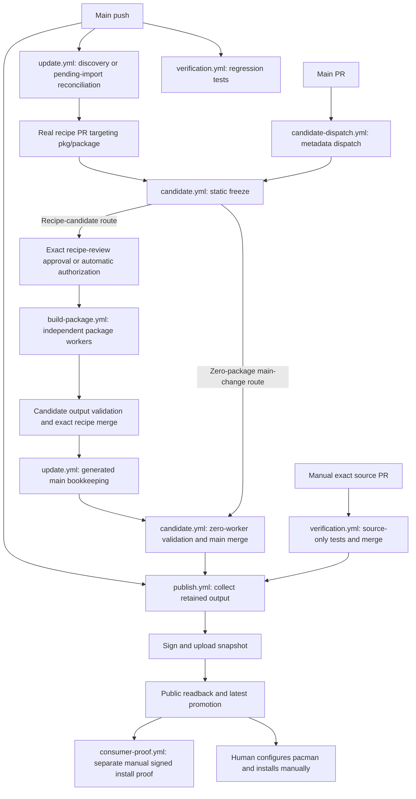
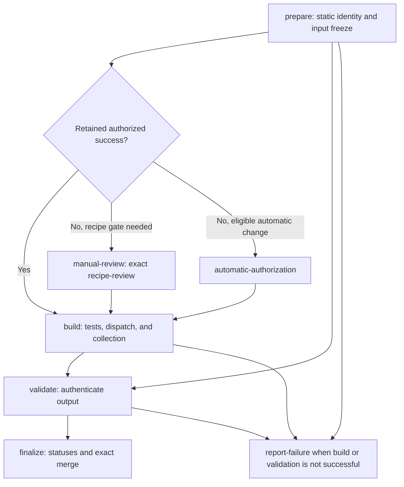
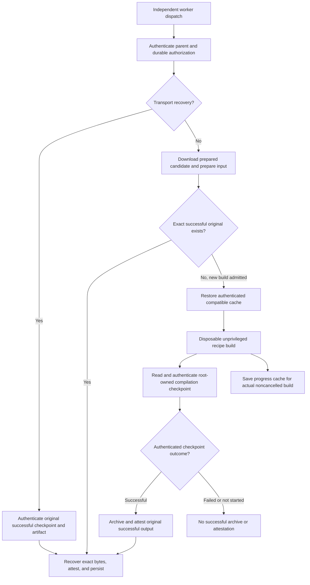
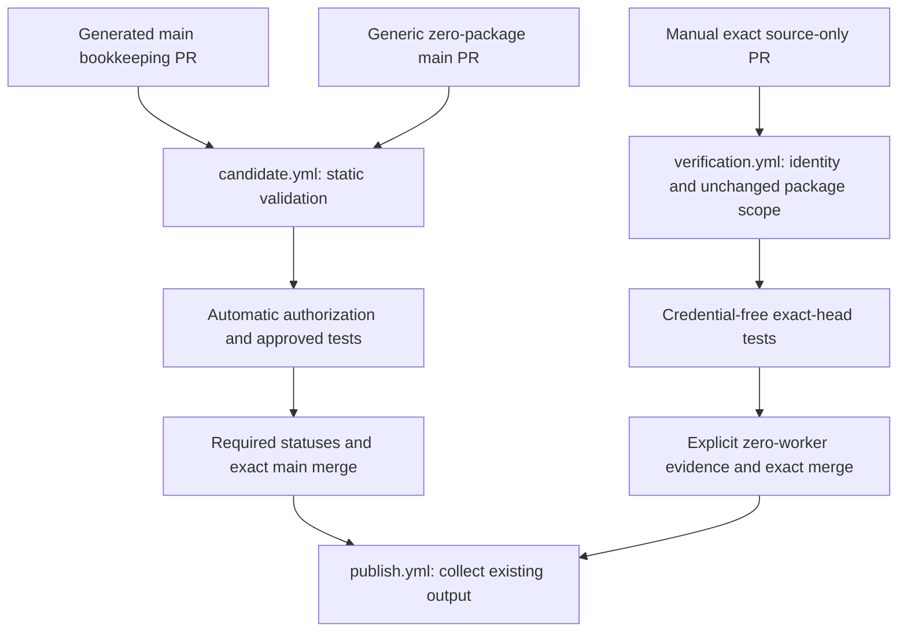
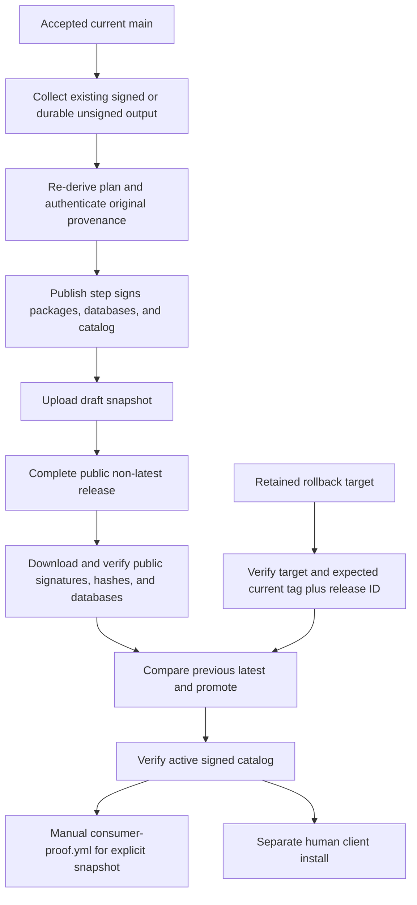

# System flow

This document explains how `arch-packages` turns source changes into reviewed
recipes, authenticated package output, and signed snapshots for Arch Linux.
It also explains what each GitHub workflow does and what its success proves.

The controller code, workflows, tests, and repository policy are maintained here.
The source fork `vith/oh-my-pi` is a package input, not an administration target.
The separate n3t repository is a signed dependency source, not managed by this
pipeline. Nothing here automatically changes a laptop or other client machine.

## Contents

- [Vocabulary and identity](#vocabulary-and-identity)
- [End-to-end lifecycle](#end-to-end-lifecycle)
- [Data ownership and retained evidence](#data-ownership-and-retained-evidence)
- [Workflow overview](#workflow-overview)
- [Source update proposals](#source-update-proposals)
- [Start candidate validation](#start-candidate-validation)
- [Exact candidate validation](#exact-candidate-validation)
- [Build one package](#build-one-package)
- [Trusted recipe and publication verification](#trusted-recipe-and-publication-verification)
- [Signed package snapshots](#signed-package-snapshots)
- [Signed snapshot consumer proof](#signed-snapshot-consumer-proof)
- [Reused action entrypoints](#reused-action-entrypoints)
- [Trust boundaries and validation limits](#trust-boundaries-and-validation-limits)
- [Failures, retries, and recovery](#failures-retries-and-recovery)
- [Operator reading guide](#operator-reading-guide)
- [Source map](#source-map)

## Vocabulary and identity

A **workflow** is an event-driven YAML file in [`.github/workflows`](../.github/workflows/).
A **run** is one invocation of that workflow. A rerun has another **attempt**
within the same run identity. Run ID and attempt number therefore matter together.
A **job** is a runner unit with dependencies, permissions, and possibly an environment.
A **step** is a sequential `run` command or `uses` action invocation inside a job.
An **action** supplies a step implementation; it is not itself a workflow.

A package **worker** is an independent `build-package.yml` workflow run, dispatched
by a candidate coordinator. It is not a step, action, or reusable-workflow job in
that coordinator. Its lifetime and compilation evidence are independently recorded.
None of the seven workflows declares `workflow_call`, and none calls a reusable
workflow through `jobs.<job>.uses`.

The candidate workflow's `prepare` job performs a **static freeze**. It reads and
validates recipe files, source identities, metadata claims, and policy without
executing the recipe. This is unrelated to a recipe's `PKGBUILD` `prepare()`
function, which is executable recipe code and may run later under `makepkg`.

The important frozen identities are:

| Identity | Meaning |
| --- | --- |
| C | The immutable trusted controller revision supplying control code and harness identity. |
| B | The exact proposal base or predecessor against which the candidate is checked. |
| H | The exact full PR head SHA under review, not a moving branch name. |
| Input digest | The authenticated identity of the frozen compilation inputs, including the relevant recipe, source locks, policy, and harness identities. |

For a recipe PR, the recipe base/head and the trusted main controller are distinct.
For a main source PR, the manual verification route also binds the exact main base.
Controller context and compilation identity must not be confused: retained exact
output can be reused across compatible controller changes without becoming a new
compilation. A changed review head is not authorized by an old approval.

The **original producer** is the authenticated run and attempt that actually
successfully compiled an input. Later collection, transport recovery, acceptance,
and publication retain that producer and its exact bytes; they do not replace it
with the identity of the latest coordinator or recovery run.

Three different mechanisms serve different purposes:

- **Attestation:** independent OIDC-backed evidence binds a candidate or worker
  archive/context to workflow provenance. Bot commit-status receipts complement
  this evidence; a status receipt is not a Sigstore attestation.
- **Package signing:** the publication key signs packages, repository databases,
  and the snapshot catalog for consumers. Worker attestation is not package signing.
- **Cache:** authorized compiler and dependency progress speeds actual builds,
  including retries after failed compilation. A cache is not original package
  output, a successful-compilation receipt, or publication authority.

## End-to-end lifecycle

The lifecycle is:

1. **Discover or register inputs.** Scheduled/default manual discovery freezes
   enrolled source identities. A pending import is registered read-only and is
   outside the routine discovery and publication roster until activation.
2. **Create a real recipe PR.** Automation writes a proposal targeting `pkg/<name>`.
   Reviewers see actual `PKGBUILD`, patches, install scripts, and recipe history,
   not only generated records on main.
3. **Freeze the candidate.** Trusted control code binds C, B, H, policy, sources,
   metadata, and input digest. Unsupported or inconsistent inputs fail validation.
4. **Authorize exactly that candidate.** New or nontrivial recipe code requires
   `recipe-review`; eligible literal updates or unchanged executable recipe code
   are authorized automatically after validation. Exact retained authorized
   successes can reuse their original record without a fresh approval.
5. **Run independent workers.** Each affected package gets its own workflow run.
   Authorization is authenticated before recipe execution or cache access.
6. **Validate and merge the recipe.** The coordinator authenticates receipts and
   output bytes, checks required statuses, and merges the exact reviewed head
   through normal branch protection, preserving reviewed and upstream history.
7. **Write main bookkeeping without another build.** Reconciliation waits for
   real completed successful authorization evidence, then records the gitlink,
   input lock, upstream tracking, and original acceptance provenance. Pending
   imports can be activated here. The generated main PR selects zero workers.
8. **Publish existing output.** Publication collects accepted retained unsigned
   output or existing signed packages, signs the snapshot, uploads it, verifies
   public downloads, and only then promotes `latest`.
9. **Prove signed consumption separately.** A human can dispatch `consumer-proof.yml`
   for an explicit retained snapshot. Publication does not invoke this workflow.
10. **Install on a client manually.** A human verifies the public key, configures
    pacman, and runs the install/update described in [the README](../README.md#install).

An unchanged source receipt with no open proposal is a no-op. It does not rewrite
an otherwise retained proposal branch. Proposal changes and refreshes require
authenticated watcher ownership before automation writes or dispatches them.

## Data ownership and retained evidence

| Location | Owner and contents | Role in the flow |
| --- | --- | --- |
| Main: [`packages.json`](../packages.json) | Enrollment policy and pending-import registry | Defines eligible package scope; registration alone does not authorize recipe execution. |
| Main: [`recipes/`](../recipes/) and [`.gitmodules`](../.gitmodules) | Exact recipe gitlinks and submodule mapping | Pins accepted recipe bodies; recipe commits remain outside the main control tree. |
| Main: [`inputs/`](../inputs/) | Frozen per-package source locks | Records exact resolved compilation inputs. |
| Main: [`upstream/`](../upstream/) | Per-package upstream tracking | Supports discovery and bookkeeping. |
| Main: [`acceptance/`](../acceptance/) | Accepted recipe and original-build mapping | Connects accepted main state to authenticated output. |
| `pkg/<name>` branches | Protected maintained recipe history | Actual recipe PR targets and accepted recipe commits. |
| `aur/<name>` branches | Authentic imported AUR history | Preserves upstream ancestry used by maintained recipes. |
| `controller-state` branch | Append-only identity receipts | Retains controller decisions and original-output descriptors. |
| Workflow artifacts | Expiring transport and diagnostic evidence | Connect jobs/runs; artifact availability alone is not durable authority. |
| Draft `build-<input_digest>` releases | Never-public retained build bytes and proof | Durable storage of original unsigned output independent of artifact expiry. |
| Public `snapshot-...` releases | Signed packages, databases, catalog, and provenance | Consumer-facing immutable snapshots; `latest` selects a verified public release. |

The `controller-state` namespaces are `proposal`, `candidate`,
`candidate-provenance`, `built`, `approved`, `acceptance`, and `built-by-input`.
Identity envelopes digest exact values. An existing identity cannot be mutated.
Concurrent saves preserve the existing tree and use an exact lease, with at most
32 retries after an observed competing ref update; they do not blindly overwrite
other retained receipts.

A durable build release contains `unsigned.tar` and `attestation.jsonl`.
The controller reads them back and verifies them before saving the immutable
`built-by-input` descriptor. Short-lived prepared artifacts are transport, not a
replacement for those original bytes and receipts.

## Workflow overview

| File and displayed workflow name | Events | Job graph | Main handoff |
| --- | --- | --- | --- |
| [`update.yml`](../.github/workflows/update.yml), Source update proposals | Main push; six-hour schedule; manual | `reconcile` → `discover` → `write-proposals`, with mode-specific skips | Recipe PRs and generated bookkeeping PRs; candidate dispatches |
| [`candidate-dispatch.yml`](../.github/workflows/candidate-dispatch.yml), Start candidate validation | Main-target `pull_request_target` events | `dispatch` | Exact PR/head dispatch on main |
| [`candidate.yml`](../.github/workflows/candidate.yml), Exact candidate validation | Manual/API `workflow_dispatch` | Prepare → authorization → build → validate → finalize; failure reporting | Independent workers, recipe/main merge, update/publication dispatch |
| [`build-package.yml`](../.github/workflows/build-package.yml), Build one package | Manual/API `workflow_dispatch` | `package` | Original unsigned bytes, attestation, durable build storage |
| [`verification.yml`](../.github/workflows/verification.yml), Trusted recipe and publication verification | Main push; manual | Push regression, or source identity → validation → merge | Regression status or zero-worker source acceptance and publication dispatch |
| [`publish.yml`](../.github/workflows/publish.yml), Signed package snapshots | Main push; manual | Collect → publish, or rollback | Verified signed public snapshot and guarded latest promotion |
| [`consumer-proof.yml`](../.github/workflows/consumer-proof.yml), Signed snapshot consumer proof | Manual only | `consumers` | Evidence from installing a specific signed snapshot |

Five workflows declare concurrency groups, all with `cancel-in-progress: false`.
`candidate-dispatch.yml` and `consumer-proof.yml` declare no concurrency group.
This prevents automatic replacement cancellation, not manual or timeout
cancellation, and does not guarantee that every queued invocation will run.

## Source update proposals

Source: [`update.yml`](../.github/workflows/update.yml), with discovery,
proposal-writing, migration, and reconciliation implemented in the [tools](../tools/).
There is no explicit `run-name`; GitHub supplies its default display title.

**Events and inputs.** Pushes to main reconcile only. The schedule is
`17 */6 * * *`: minute 17 at 00:00, 06:00, 12:00, and 18:00 UTC. Manual inputs are:

| Input | Type and default | Effect |
| --- | --- | --- |
| `bootstrap` | Optional boolean, `false` | Read-only initial static source freeze; no proposals or recipe execution. |
| `migrate_pr` | Optional string, empty | Convert or backfill one legacy main recipe-update PR using trusted main. |
| `reconcile_pr` | Optional string, empty | Reconcile only one existing native recipe or bookkeeping PR. |

Bootstrap, migration, and targeted reconciliation are mutually exclusive.
PR inputs must be positive decimal PR numbers. These modes run on main only.
Trusted checkouts use the event SHA; tools refuse a controller that is no longer
current main instead of treating a stale run as current authority.

**Jobs.** `reconcile` comes first except in ordinary bootstrap. It recovers eligible
recipe and bookkeeping work. Full reconciliation can redispatch every open
enrolled recipe PR and the current bookkeeping PR; retired package-root targets
are recorded as skipped. `discover` depends on reconciliation and uses `always()`
to accept success or the bootstrap skip, but excludes push and explicit recovery.
`write-proposals` depends on discovery and excludes bootstrap and both recovery modes.

On a schedule or default manual run, this gives reconciliation, discovery, and
proposal writing. On push, only reconciliation runs. Bootstrap only freezes and
uploads read-only receipts. `reconcile_pr` fetches only the selected PR and does
not redispatch unrelated PRs, discover sources, or write new source proposals.

`migrate_pr` is a different operation: it authenticates a retired main proposal's
exact one-root enrolled change, bot receipt, source identity, predecessor, and
current policy. It supports open conversion and accepted legacy backfill, then
creates or reuses a package-root replacement and dispatches a fresh exact candidate.
Legacy approvals do not transfer. The old PR is not automatically closed.

The writer checks current main and the recipe predecessor, validates watcher
ownership, and writes `recipe-updates/<name>/<watcher>` PRs to `pkg/<name>` while
preserving upstream ancestry. It explicitly dispatches candidate validation
because these PRs are outside the main-target dispatch workflow's event scope.

**Boundaries and transport.** Discovery has contents-read permission.
Reconciliation and writing have contents, PR, Actions, and status writes.
There is no recipe execution, worker cache, approval environment, or signing key.
`source-receipts` contains `source-data.tar` and is retained for 2 days.
The writer downloads it, performs bounded extraction, and validates it before writes.
Concurrency is `source-update`, with replacement cancellation disabled.

## Start candidate validation

Source: [`candidate-dispatch.yml`](../.github/workflows/candidate-dispatch.yml).
There is no explicit run title and no manual inputs.

The event is `pull_request_target` targeting main, for `opened`, `synchronize`,
`reopened`, and `ready_for_review`. Its only job, `dispatch`, runs for non-drafts.
It reads current PR metadata, requires an open PR targeting main, and dispatches
`candidate.yml` on main with the numeric PR and current full head SHA.

This workflow does not check out a PR, execute candidate files, use actions,
select a package cache, enter an approval environment, or access signing secrets.
Its permissions are contents-read, PR-read, and Actions-write. There are no
artifacts, job dependencies, or declared concurrency group.

Package-root PRs have no workflows on their recipe branches and are not covered
by this main-target event. The writer, reconciliation, or a manual dispatch starts
their candidate run explicitly. This metadata dispatcher does not choose the
separate source-only verification workflow; candidate preparation can itself
classify a main change as requiring zero package workers.

## Exact candidate validation

Source: [`candidate.yml`](../.github/workflows/candidate.yml), using candidate,
acceptance, update, and build-store implementations in the [tools](../tools/).
Its only event is `workflow_dispatch`, used by both humans and automation.
Required string inputs are `pr_number` and `expected_head`; neither has a default.
Control and harness code come from trusted main, not the recipe PR.

The run title is `Candidate PR <pr_number> head <expected_head>`.
This makes exact head identity visible and available for provenance checks.
Preparation is main-only and has a 30-minute timeout.

**Prepare.** This job freezes source, recipe, policy, metadata, base/head, and
compilation identity without running `PKGBUILD`. It independently OIDC-attests
`candidate.json` before fresh authorization unless original provenance already exists.
Its outputs include `base`, `head`, `mechanical`, `review_environment`, and
`authorized_reuse`. `prepared-candidate-<attempt>` retains prepared files for 2 days.

**Authorization.** `manual-review` and `automatic-authorization` both depend on
prepare, but only the selected route runs. Manual review is used when the frozen
candidate needs an environment; the current new-recipe gate is `recipe-review`.
Its job title is `Review PR <N> head <H> base <B>`. The automatic job title is
`Authorize PR <N> head <H> base <B>`. Both revalidate exact identity and persist
authorization rather than treating a displayed approval as permission for any head.

New and nontrivial recipe code requires exact review before execution.
Enrolled literal version, `pkgrel`, and checksum edits, or unchanged executable
recipe code, can qualify for automatic authorization after independent checks.
An authenticated existing successful exact input can return the original record
with current-controller context and set `authorized_reuse=true`, skipping both
fresh authorization jobs. New authorization does not use `code-review` or a
separate human gate for main bookkeeping.

**Build and validate.** The build job depends on prepare and both authorization
jobs, but its explicit `always()` condition admits authorized reuse or either
successful route; the skipped inactive route does not suppress it. It runs
approved tests, dispatches independent workers, and collects their output.
For a native recipe candidate, the tests verify identity and authorization rather
than executing source tests. The coordinator does not compile packages.
Its timeout is 190 minutes; `native-candidate-<attempt>` is retained for 2 days.

Validation depends on successful prepare and build. It authenticates exact native
receipts and bytes. `report-failure` depends on prepare, build, and validation,
and reports candidate-build failure when preparation succeeded but build or
validation did not. It is reporting, not an automatic compiler retry loop.

**Finalize.** This job depends on prepare, validate, and both authorization routes.
It requires successful validation and either authorization or authorized reuse.
It verifies `verify`, `candidate-build`, and `recipe-policy`, then merges the exact
reviewed head through normal protection. A recipe merge dispatches `update.yml`
for bookkeeping. An ordinary main merge dispatches `publish.yml` with accepted SHA.

**Permissions and retention.** The default is contents-read. Prepare additionally
has contents-write, Actions/PR-read, statuses-write, and OIDC/attestations-write.
Authorization and validation use contents/statuses-write and Actions/PR-read.
Build uses contents/statuses/Actions-write and PR-read. Failure reporting uses
contents/PR-read and statuses-write; finalize has contents/PR/statuses/Actions-write.
Trusted checkouts do not persist credentials. No job receives the publication
private key, and only the independent workers use the compiler cache.
Concurrency is `candidate-<PR>`, without replacement cancellation.

## Build one package

Source: [`build-package.yml`](../.github/workflows/build-package.yml), with worker,
archive, cache, and recovery handling in the [tools](../tools/).
This is an independent `workflow_dispatch` workflow with one main-only `package`
job, a 150-minute timeout, and no per-worker approval environment.

Its title is `Build <package> / <publication_run>.<publication_attempt> / <input_digest>`.
Despite their names, `publication_run` and `publication_attempt` identify the
**original candidate approval parent**, not a publishing run that compiles packages.

| Input | Type and default | Meaning |
| --- | --- | --- |
| `package` | Required string, no default | Explicitly authorized package. |
| `publication_run` | Required string, no default | Original approval candidate run ID. |
| `publication_attempt` | Required string, no default | Original approval candidate attempt. |
| `input_digest` | Required string, no default | Exact authorized compilation input identity. |
| `recovery_mode` | Boolean, `false` | Transport-only recovery, never compilation. |
| `original_run` | String, empty | Original successful producer run for recovery. |
| `original_attempt` | String, empty | Original successful producer attempt for recovery. |
| `original_artifact` | String, empty | Serialized immutable producer artifact JSON including ID, ZIP digest, and size, for transport recovery only. |
| `original_candidate_key` | String, empty | Historical candidate receipt key for legacy transport recovery. |
| `archive_format` | Choice, `native-v2` | Authenticated archive protocol; also accepts `legacy-native-v1`. |

Before recipe execution or cache access, the worker authenticates the parent
workflow path, head, run, attempt, and exact durable authorization.
New compilation admission also requires current main/control to match.
A retained success can be materialized without recompilation.

On the normal route, it downloads the parent's prepared-candidate artifact using
a token. Preparation either reuses an authenticated successful original or exports
the single owned recipe input. Historical harnesses requiring other recipe files
retain full payload exports; the complete enrolled roster and immutable pins are
still authenticated. `build.sh` runs the recipe as an unprivileged builder in a
disposable pinned Arch x86_64 container.

`recovery_mode` authenticates the original successful producer and exact artifact
ID, digest, and size, recovers bytes, and attests/persists them. It does not build
or use the compiler cache. The format choice selects the authenticated native-v2
or legacy-native-v1 archive contract; it is not permission to invent a new archive
or substitute bytes. The legacy candidate key is historical identity evidence.

**Checkpoint evidence.** Root-owned `compilation.json` distinguishes successful,
failed, and not-started compilation. Checkpoint steps deliberately use
`continue-on-error`: only the step matching the authenticated state becomes a
success marker. The overall workflow color is not the compilation checkpoint.
A successful compile can therefore be followed by a red upload or persistence step.

Successful `unsigned.tar` and `attestation-context.json` are OIDC-attested.
The candidate, compilation checkpoint, context, and bundle are archived as
`package-<package>-<run>-<attempt>`, retained for 90 days. Authenticated original
bytes and proof are then persisted to durable never-public draft build storage.

**Cache.** Only normal, authorized, non-reused builds restore/save it. The path is
`~/.local/state/arch-packages/cache/<package>`. Its scope begins
`trusted-build-v1-linux-x86_64-<package>-<image-and-harness-hash>-`, where the hash
is the first 24 characters of the SHA256 image/harness identity. The key also
includes input digest and current run/attempt. Restore falls back to the exact
input prefix and then a compatible package/image/harness prefix.

The cache holds Cargo/rustup/target, Bun, Go build/module, and pip directories.
An actual build saves progress after success or failure if not cancelled and not
an exact cache hit. Cache errors are nonfatal, and runner ownership is repaired.
Cache contents never replace an original successful package archive.

The job has contents-write, Actions-read, statuses-write, and OIDC/attestations-write.
API credentials and OIDC capability remain outside the recipe container; no
publication signing secret is available. Concurrency is
`approved-package-<input_digest>`, without replacement cancellation.

## Trusted recipe and publication verification

Source: [`verification.yml`](../.github/workflows/verification.yml) and the
source-review and verification implementations in the [tools](../tools/).
This workflow has two separate routes: main-push regression testing and manual
exact source-only PR acceptance. Neither compiles packages.

Push runs are titled `Trusted main verification <SHA>`.
Manual runs are titled `Source review PR <N> head <H> base <B>` and require string
inputs `pr_number`, `expected_head`, and `expected_base`, with no defaults.
The optional boolean `bootstrap` defaults to `false`.

**Push route.** The independent `regression-tests` job runs only on main push,
with a 30-minute timeout. It marks `verify` pending, runs the entire test suite
in a pinned Arch container with native `vercmp`, and reports success, failure,
or error. These are regression tests, not installation of enrolled packages.
Provisioning trusted official verification tools is not execution of a recipe.

**Manual route.** `source-identity` → `source-validation` → `source-merge` binds
one exact open, same-repository PR targeting main. Identity checks require base
=current main, exact head, expected workflow run/ref/path/title, and allowed
package scope before checkout. Ordinary control comes from immutable base/main.
With `bootstrap=true`, the initial controller comes from the exact lightweight
commit tag `source-review-<H>`, not a moving head branch.
This is not the read-only source-discovery bootstrap in `update.yml`.

Protected package scopes—`packages.json`, `.gitmodules`, `recipes`, `inputs`,
`upstream`, and `acceptance`—must be unchanged, and materialized recipe bodies
are also verified. External-fork PRs are rejected by this route.
Source validation runs the exact head's tests in a credential-free pinned Arch
container and writes all three required statuses, including explicit zero-worker
`candidate-build` evidence. `source-review-evidence-<attempt>` lasts 90 days.
Source merge verifies a real successful validation job and the statuses before
normal exact-head merge. It explicitly dispatches publication because an
Actions-token merge does not trigger ordinary push workflows.

The generic candidate route and this manual source-only route are distinct.
Generated bookkeeping uses the candidate route with zero selected packages;
no second recipe approval or compilation is needed. Stale bookkeeping is
independently revalidated and reconstructed on latest main, and a validated
replacement may close the obsolete PR. Its paths are gitlink, lock, upstream,
and acceptance records, plus optional pending-import activation in `packages.json`.

There is no human approval environment, worker cache, package compilation, or
signing secret in verification. Default permissions are contents-read and
statuses-write. Source identity uses contents/PR/Actions-read; validation adds
statuses-write. Source merge has contents/PR/Actions-write and statuses-read.
Concurrency is `verification-<event>-<PR or ref>`, without replacement cancellation.

## Signed package snapshots

Source: [`publish.yml`](../.github/workflows/publish.yml) and publication,
plan, readback, and rollback implementations in the [tools](../tools/).
Events are main push and manual dispatch. There is no explicit run title.

| Input | Type and default | Meaning |
| --- | --- | --- |
| `accepted_sha` | Optional string; resolves to event SHA when omitted | Exact accepted main commit for publication. |
| `operation` | Choice, `publish` | `publish` or `rollback`. |
| `target_tag` | Optional string, no declared default | Retained snapshot to restore in rollback mode. |
| `expected_tag` | Optional string, no declared default | Expected current latest snapshot tag for rollback. |
| `expected_release_id` | Optional string, no declared default | Expected current latest release ID for rollback. |

The publish graph is `collect` → `publish`; rollback is a mutually exclusive
independent job. Collection and rollback are main-only. Both collection and
publication rebind the requested accepted SHA to current trusted main; stale
accepted targets fail closed. Publication never dispatches a worker, compiles a
package, or falls back to rebuilding when output is missing.

**Collection.** The contents/Actions-read job derives a plan bound to the previous
signed catalog, then collects existing signed reuse or authenticated accepted
durable unsigned builds. It has no signing secrets or compiler cache and a
190-minute timeout. `publication-plan-<attempt>` and
`unsigned-publication-<run>-<attempt>` are retained for 7 days.

**Signing and publication.** The publish job depends on collection, uses the
`publish` environment, and has contents-write and Actions-read permission.
It revalidates current main before checkout, provisions tools before the secret
step, downloads the unsigned handoff, and fully re-derives and validates the plan
and original provenance. Only the signing step receives `ARCH_SIGNING_KEY`,
`ARCH_SIGNING_PASSPHRASE`, and `ARCH_SIGNING_FINGERPRINT`.

It builds repository databases from package files, not packages from source.
New packages, databases, and catalog are signed. Unchanged packages retain their
bytes, signatures, and original producer proof. The snapshot tag is
`snapshot-<accepted_sha>-<run_id>-<attempt>`.

Public readback checks signatures, hashes, databases, and catalog before latest
promotion, followed by verification of the active signed catalog. It is not a
full signed consumer install or runtime test. The always-uploaded
`publication-receipt-<run>-<attempt>` contains `publication-result.json`; missing
publication receipt evidence is an error.

**Rollback.** The rollback job also uses the `publish` environment, but receives
no private signing-key environment. It verifies the retained public target,
signed catalog, and bytes, and requires both the expected current latest tag and
release ID. It promotes that exact retained release without deleting releases,
building packages, or re-signing anything. Its receipt is always uploaded;
missing rollback receipt evidence produces a warning. Rollback across the
repository rename requires clients to select the matching database section name.

Publish and rollback share `arch-packages-publication` concurrency, with
replacement cancellation disabled. Environment policy comes from
[OpenTofu](../opentofu/), not an assumption about live GitHub approval settings.
The declared policy is discussed under [trust boundaries](#trust-boundaries-and-validation-limits).

## Signed snapshot consumer proof

Source: [`consumer-proof.yml`](../.github/workflows/consumer-proof.yml), using
`consumer.py` and `smoke.sh` in the [tools](../tools/).
This workflow is manual-only and has no explicit run title.
Its required string input is `snapshot_tag`, with no default.

The single `consumers` job has a 60-minute timeout and contents-read permission.
It checks out the dispatch ref, with credentials not persisted; there is no
main-only condition, approval environment, cache, private signing secret, or
concurrency declaration.

The consumer verifies the specified public signed snapshot and resolves enrollment
from that snapshot's accepted commit, not today's package roster. It writes
`expected.json` and `enrollment.json`. The smoke harness installs every expected
enrolled output into a fresh Arch root, requiring signed databases and packages,
and executes package consumer proofs.

`consumer-proof-<run>-<attempt>` is uploaded even on failure and lasts 14 days;
missing evidence produces a warning. This proof uses retained public snapshot
assets, not expiring original worker artifacts. It is not automatically called
by publication and does not install anything on a user's machine.

## Reused action entrypoints

There are six `uses` entrypoints from five repositories. Cache restore/save are
separate entrypoints from the same repository and commit. Every reference is
pinned to a full commit SHA, and every checkout sets `persist-credentials: false`.

| Entrypoint | Role | Workflow users (pins in linked YAML) |
| --- | --- | --- |
| [`actions/checkout`](https://github.com/actions/checkout) | Trusted controller, worker, test, or dispatched-ref checkout | [update](../.github/workflows/update.yml), [candidate](../.github/workflows/candidate.yml), [build-package](../.github/workflows/build-package.yml), [verification](../.github/workflows/verification.yml), [publish](../.github/workflows/publish.yml), [consumer-proof](../.github/workflows/consumer-proof.yml) |
| [`actions/upload-artifact`](https://github.com/actions/upload-artifact) | Bounded handoffs and expiring evidence, not durable package authority | [update](../.github/workflows/update.yml), [candidate](../.github/workflows/candidate.yml), [build-package](../.github/workflows/build-package.yml), [verification](../.github/workflows/verification.yml), [publish](../.github/workflows/publish.yml), [consumer-proof](../.github/workflows/consumer-proof.yml) |
| [`actions/download-artifact`](https://github.com/actions/download-artifact) | Prepared/native/publication handoffs, including authorized cross-run downloads | [update](../.github/workflows/update.yml), [candidate](../.github/workflows/candidate.yml), [build-package](../.github/workflows/build-package.yml), [publish](../.github/workflows/publish.yml) |
| [`actions/attest`](https://github.com/actions/attest) | Independent candidate provenance and worker archive/context OIDC attestation | [candidate](../.github/workflows/candidate.yml), [build-package](../.github/workflows/build-package.yml) |
| [`actions/cache/restore`](https://github.com/actions/cache/tree/main/restore) | Compatible authorized package cache restore | [build-package](../.github/workflows/build-package.yml) |
| [`actions/cache/save`](https://github.com/actions/cache/tree/main/save) | Actual successful/failed noncancelled compilation progress retention | [build-package](../.github/workflows/build-package.yml) |

The metadata dispatcher uses no actions. Shell commands, Python scripts, `gh`,
and `docker` are `run` steps, not additional reusable actions. Independent worker
dispatch is also not a reusable-workflow call.

## Trust boundaries and validation limits

**Authorization before code.** Static inspection and exact recipe review precede
execution of new recipe code. API tokens belong to trusted host tools outside
the recipe container. Neither historical transport recovery nor API availability
creates permission to execute an unapproved recipe.

**Worker container.** The build harness may bind one explicitly authenticated,
non-symlink, job-owned per-package cache directory to `/ci-cache`. It copies
recipe inputs, trusted harness, and public keys with `docker cp`, and copies
output/checkpoint evidence back. It does not bind host root, home, checkout,
credential directories, or the Docker socket. The recipe runs as UID 1000 with
dropped privileges, explicit PATH/cache configuration, and no inherited token
environment. This is not a container with no host mounts: the cache bind is real.

Build dependencies resolve from official Arch repositories first, then signed
`vith-gh`, then signed `vith-arch` at n3t. Custom repositories require trusted
package and database signatures. Workers resolve GitHub's latest-release redirect
to a fixed dependency snapshot before installation; manual consumers keep their
explicitly selected snapshot. Neither receives publication signing credentials.

**Publication container and key.** Repository database staging uses `/packages`
read-only and `/out` writable bind mounts. The container drops all capabilities,
uses no-new-privileges and a sanitized environment, and has no private-key home,
tokens, or Docker socket. The private signing key is scoped to the host signing
step's environment, not a recipe worker or general provisioning step.

**Consumer container.** Data is copied in; there are no host bind mounts.
Internally the disposable container mounts fresh tmpfs, devpts, and proc to create
a clean chroot. This setup requires `SYS_ADMIN`, `MKNOD`, and
`apparmor=unconfined`. Package consumers themselves drop capabilities using
`setpriv` and start with `env -i`; public proofs additionally use `unshare --net`.
These boundaries differ from both the worker cache mount and publication staging.

**Source tests.** Exact source-only tests run in a credential-free pinned Arch
container. Trusted host tools perform GitHub metadata/status/merge work outside
that test container. Main-push regression is separate from package installation.

**Environment policy.** [OpenTofu configuration](../opentofu/) is the policy source.
It currently declares a reviewer for `recipe-review` and a main-only `publish`
environment without declared reviewers. The retained `code-review` environment
has no new reviewers and exists for historical producer proof. Workflow YAML
alone does not establish deployed required-reviewer settings; this document does
not infer live settings from environment names.

**What automatic validation checks.** Workers check native `.SRCINFO` consistency
before and after `makepkg`, output identity/version/architecture/hashes, and
source-lock receipts. OMP-specific runtime checks cover `--version`, `--help`,
the addon fork stamp, and PipeWire linkage. A recipe may also define checks that
`makepkg` executes during its build. The coordinator authenticates these receipts
and output; it does not run a full signed consumer installation.

**What requires the separate manual proof.** Full `smoke.sh`, ApexShot, and public
consumer checks are wired through `consumer-proof.yml`, not candidate validation
or publication. ApexShot checks include CLI version/help, native messaging,
shared-library resolution, desktop assets, and extension files. Comments about
sharing a proof do not constitute an automatic invocation of it.

Even a successful signed consumer proof does not demonstrate interactive capture
or recording in a live GNOME/Wayland session. Desktop extension enablement,
logout/login, and actual UI use remain manual. Publication readback proves public
snapshot integrity, not this desktop behavior.

Public trust material is in [`keys/`](../keys/): `arch-packages.asc`, `fingerprint`,
and the dependency key `n3t.asc`. The full package-signing fingerprint is
`9C293ABB1F701DA04BA2C0D5711FC9BDDC5AF617`. Private administrative signing material
and the OpenTofu passphrase are local state described in the
[README administration section](../README.md#administration), not recipe inputs.

## Failures, retries, and recovery

| Situation | Current behavior and safe interpretation |
| --- | --- |
| Genuine failed compilation | An actual failed compile can retry with compatible trusted cache. Collector failure does not itself loop compiler retries. |
| Successful compilation, then storage/collection/validation/publication failure | Reuse the exact original bytes and original producer; do not compile again. Transport recovery may use another worker run but never compiles. |
| Missing original bytes or uncertain compilation outcome | Fail closed. Unrecoverable successful output or uncertain attempted outcome is not permission to rebuild. |
| Changed recipe PR head | Reject stale identity and require fresh exact authorization. |
| Stale generated bookkeeping | Revalidate and reconstruct data on latest main; do not repeat recipe approval or compilation. |
| Invalid package, database, catalog, or provenance signatures | Abort validation, consumption, or publication rather than weakening trust requirements. |
| Rollback to retained exact snapshot | Verify retained signed bytes and current tag plus release-ID guards; promote without rebuilding or re-signing. |
| API refusal, including HTTP 403 | Treat the refusal as a failure, not authorization. Do not assume every 403 is quota exhaustion or bypass identity checks. |
| Cache restore/save failure | Cache errors are nonfatal; cache is neither output evidence nor an authorization substitute. |

Recovery first seeks the durable descriptor, then bounded historical worker runs
and attempts. It uses actual authenticated compilation checkpoints, not the
workflow's overall green/red result. A failed or not-started attempt can allow
searching older successful originals; uncertain attempted outcomes or an
unrecoverable successful artifact refuse recompilation.

Retained builds authenticate ordered harness/controller manifests declared in
their own immutable source files, including declaring-source bytes and modes.
Recovery parses literal declarations without executing historical Python.
Later manifest additions do not invalidate original proof; missing declared files
and unsafe paths are refused. Historical single-root export fallback uses the
same declared harness identity.

Archive tooling is provisioned before approval/recovery preparation.
`bsdtar` is required for persistence, recovery, and bookkeeping proof. Actions
ZIP downloads and release-asset downloads negotiate their different media types;
storage redirects do not receive the API authorization token.

The collector polls every 30 seconds for up to 10,800 seconds, within a
190-minute job ceiling. Workers have a 150-minute ceiling. Coordinator failure
or movement is not a child cancellation instruction; independent worker evidence
must still be inspected. Manual and timeout cancellations remain possible.

**Present implementation caveat: unnecessary pre-approval history recovery.**
`recipe_candidates._completed_candidate` runs before new static classification
and fresh approval. It scans retained candidate keys matching recipe base/head
and calls `build_store.lookup` without first filtering out unapproved candidates.
Lookup can fall through to `package_runs.recover`, querying historical runs,
jobs, and artifacts merely to establish that an unapproved static candidate has
no completed build. This avoidable API work is present, not fixed or gated away.
It is not legitimate authorization: any recovered original still has to pass
`verify_authorization` and provenance checks before reuse or execution admission.
No current API counts, reset times, or migration progress are implied here.

## Operator reading guide

- **Start with the coordinator for identity.** Its title identifies PR and exact
  head; prepare records frozen base, controller context, and input identity.
  Review the actual package-root files, not just main bookkeeping.
- **Open the child worker for compilation stdout.** The candidate coordinator
  links child runs and reports state transitions; it does not contain the live
  compiler process. Worker output also remains in the build receipt.
- **Read the compilation marker separately from the run color.** A successful
  checkpoint followed by a red artifact, storage, or collection step means
  recover original bytes, not compile again. A genuine failed checkpoint is a
  different case and may retry using cache.
- **Use the narrow recovery mode when appropriate.** `update.yml` with
  `reconcile_pr` targets one existing recipe/bookkeeping PR. Migration and
  read-only bootstrap have different contracts and cannot be combined with it.
- **Separate three outcomes.** Signed publication and public readback establish
  snapshot integrity. A manual consumer proof establishes installation and the
  implemented package checks for a named snapshot. A client installation is a
  separate human action on that machine.
- **Keep signature checking enabled.** Follow [Install](../README.md#install),
  verify the full public fingerprint, and use the database section name matching
  the snapshot. Current snapshots use `[vith-gh]`; historical snapshots with
  `arch-packages.db` use `[arch-packages]`. The separate `[vith-arch]` n3t
  dependency repository is not renamed by this pipeline.

## Source map

The primary contracts are the seven linked workflow files above. Supporting
implementation is in [tools](../tools/), with regression evidence in
[tests](../tests/). Repository/environment policy is in [OpenTofu](../opentofu/).

Within the tools, `update.py` handles dispatch/finalization and source update
work; `recipe_candidates.py` handles native candidates and retained-candidate
lookup; `recipe_acceptance.py` handles accepted-recipe reconciliation;
`package_runs` and `build_store` handle independent-run recovery and durable
original output. `native.py` and `build.sh` define native worker validation,
cache/container boundaries, and compilation execution. Publication code defines
plan collection, signing, public readback, and promotion; `consumer.py` and
`smoke.sh` define the separate signed-install proof. The [README](../README.md)
contains client installation and local administrative procedures.
